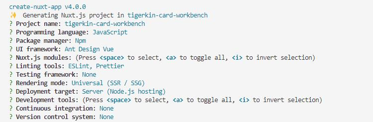

## nuxt
安装依赖
```
npm i -g create-nuxt-app
```
创建项目
```
npm init nuxt-app project
```
选择功能(示例截图)



## eslint&prettier
安装 eslint 依赖
```
npm i @vue/cli-plugin-eslint eslint eslint-plugin-vue @vue/eslint-config-standard --save-dev
```

.eslintrc.js
```js
module.exports = {
    root: true,
    env: {
        browser: true,
        node: true,
    },
    parserOptions: {
        parser: '@babel/eslint-parser',
        requireConfigFile: false,
    },
    extends: [
        'plugin:vue/strongly-recommended',
        '@vue/standard',
        '@nuxtjs',
        'plugin:nuxt/recommended',
        'prettier'
    ],
    plugins: [],
    // add your custom rules here
    rules: {
        'no-console': 'off',
        'no-debugger': process.env.NODE_ENV === 'production' ? 'error' : 'off',
        'generator-star-spacing': 'off',
        'no-mixed-operators': 0,
        'linebreak-style': [0, 'error', 'windows'],
        'vue/max-attributes-per-line': ['error', {
            singleline: {
                max: 1
            },
            multiline: {
                max: 1
            }
        }], // 定义属性格式
        'vue/attribute-hyphenation': 0,
        'vue/html-self-closing': ['error', {
            html: {
                void: 'always',
                normal: 'always',
                component: 'always'
            },
            svg: 'always',
            math: 'always'
        }], // vue template 标签关闭样式
        'vue/component-name-in-template-casing': 0,
        'vue/html-closing-bracket-spacing': 0,
        'vue/singleline-html-element-content-newline': 0,
        'vue/no-unused-components': 0,
        'vue/multiline-html-element-content-newline': 0,
        'vue/no-use-v-if-with-v-for': 0,
        'vue/html-closing-bracket-newline': 0,
        'vue/no-parsing-error': 0,
        'no-tabs': 'off',
        'quotes': [
            2,
            'single',
            {
                'avoidEscape': true,
                'allowTemplateLiterals': true
            }
        ],
        'semi': [
            2,
            'never',
            {
                'beforeStatementContinuationChars': 'never'
            }
        ],
        'no-delete-var': 2,
        'prefer-const': [
            2,
            {
                'ignoreReadBeforeAssign': false
            }
        ],
        'vue/html-quotes': ['error', 'double', { avoidEscape: true }], // vue template 单双引号配置
        'template-curly-spacing': 'off',
        indent: ['error', 4], // 定义缩进
        'standard/no-callback-literal': 0,
        'vue/html-indent': ['error', 4, {
            attribute: 1,
            baseIndent: 1,
            closeBracket: 0,
            alignAttributesVertically: true,
            ignores: []
        }], // 定义vue template 缩进
    },
    overrides: [
        {
            files: [
                '**/__tests__/*.{j,t}s?(x)',
                '**/tests/unit/**/*.spec.{j,t}s?(x)'
            ],
            env: {
                jest: true
            }
        }
    ]
}
```

prettier配置
```js
{
  "tabWidth": 4,
  "useTabs": false,
  "printWidth": 120,
  "semi": false,
  "singleQuote": true,
  "bracketSpacing": true,
  "trailingComma": "none",
  "prettier.spaceBeforeFunctionParen": true
}
```

## eslint-webpack-plugin
eslint-loader 已不再维护，现使用eslint-webpack-plugin

安装依赖  
```
npm install eslint-webpack-plugin@2.7.0 // webpack 为4.x版本
npm install eslint-webpack-plugin@3.2.0 // webpack 为5.x版本
```

nuxt.config.js
```js
export default {
  ...,
  build: {
    extend(config, ctx) {
      if (ctx.isDev && ctx.isClient) {
        const options = {
          exclude: ['node_modules']
        }
        const EslintPlugin = require('eslint-webpack-plugin')
        config.plugins.push(new EslintPlugin(options))
      }
    }
  }
}
```

## env
安装依赖
```
npm i cross-env --save-dev
```

env.js
```js
export default {
    // 开发环境
    dev: {
       NODE_ENV: 'development',
        BASE_CLIENT_URL: '/api/**/,
        RAM_CLIENT_URL: '/api/ram/**',
        BASE_SERVER_URL: 'http://**/api/ram/comapss/v1',
        RAM_SERVER_URL: 'http://**/v1'
    },
    // 测试环境
    test: {
        NODE_ENV: 'development',
        ...
    },
    // 生产环境
    prod: {
        NODE_ENV: 'production',
        ...
    }
}
```

nuxt.config.js
```js
import env from './env'

export default {
  ...,
  env: {
      BASE_CLIENT_URL: env[process.env.NODE_ENV].BASE_CLIENT_URL,
      BASE_SERVER_URL: env[process.env.NODE_ENV].BASE_SERVER_URL,
      NODE_ENV: env[process.env.NODE_ENV].NODE_ENV
  }
}
```

## proxy

安装依赖
```
npm i @nuxtjs/proxy --save-dev
```

nuxt.config.js
```js
export default {
  ...
  modules: [
    '@nuxtjs/proxy'
  ],
  // 代理
  proxy: {
      '/api/compass/v1': {
          target: `http://**/api/ram/comapss/v1`,
          changeOrigin: true,
          pathRewrite: {
              '^/api/compass/v1': ''
          }
      },
      '/api/ram/comapss/v1': {
          target: `http://**/v1`,
          changeOrigin: true,
          pathRewrite: {
              '^/api/ram/comapss/v1': ''
          }
      }
  }
}
```
