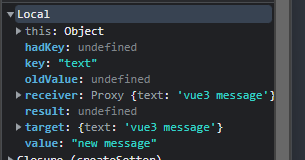

```js
<script src="../../dist/vue.global.js"></script>

<div id="app">
  {{ message }}
</div>

<script>
const { reactive, createApp } = Vue

createApp({
	setup() {
        const message = reactive({
			text: 'vue3 message'
		})
		debugger
		message.text = 'new message'
		console.log(message.text)
        return {
            message
        }
	}
}).mount('#app')
</script>
```

1. 设值

```ts
// 调用baseHandlers中createSetter方法
function createSetter(shallow = false) {
  return function set(
    target: object,
    key: string | symbol,
    value: unknown,
    receiver: object
  ): boolean {
    let oldValue = (target as any)[key] // old = message['text']
    if (isReadonly(oldValue) && isRef(oldValue) && !isRef(value)) {
      return false
    }
    if (!shallow) {
      // 值不是浅处理或者只读
      if (!isShallow(value) && !isReadonly(value)) {
        oldValue = toRaw(oldValue)
        value = toRaw(value)
      }
      // 如果目标对象不是数组并且oldValue是ref类型并且现在的值不是ref类型
      if (!isArray(target) && isRef(oldValue) && !isRef(value)) {
        oldValue.value = value
        return true
      }
    } else {
      // in shallow mode, objects are set as-is regardless of reactive or not
      // 浅处理的话什么也不做
    }


    // isIntegerKey - key为整数
    const hadKey =
      isArray(target) && isIntegerKey(key)
        ? Number(key) < target.length
        : hasOwn(target, key)
    const result = Reflect.set(target, key, value, receiver)
    // don't trigger if target is something up in the prototype chain of original
    // @TODO 深入了解trigger函数
    if (target === toRaw(receiver)) {
      if (!hadKey) {
        trigger(target, TriggerOpTypes.ADD, key, value)
      } else if (hasChanged(value, oldValue)) {
        trigger(target, TriggerOpTypes.SET, key, value, oldValue)
      }
    }
    return result
  }
}

function trigger(
  target: object,
  type: TriggerOpTypes,
  key?: unknown,
  newValue?: unknown,
  oldValue?: unknown,
  oldTarget?: Map<unknown, unknown> | Set<unknown>
)
/**
    target：要触发的对象。
    type：触发的操作类型，可能的值有："set"、"add"、"delete"、"clear"。
    key（可选）：如果 target 是一个对象，则为要更新的属性名；如果 target 是一个数组，则为要更新的索引。
    newValue（可选）：如果触发的操作是 "set" 或 "add"，则为新值。
    oldValue（可选）：如果触发的操作是 "set"，则为旧值。
    oldTarget（可选）：如果触发的操作是 "delete" 或 "clear"，
 */
```

2. 取值
```ts
// @TODO 深入了解createGetter函数
function createGetter(isReadonly = false, shallow = false) {
  return function get(target: Target, key: string | symbol, receiver: object) {
    if (key === ReactiveFlags.IS_REACTIVE) {
      return !isReadonly
    } else if (key === ReactiveFlags.IS_READONLY) {
      return isReadonly
    } else if (key === ReactiveFlags.IS_SHALLOW) {
      return shallow
    } else if (
      key === ReactiveFlags.RAW &&
      receiver ===
        (isReadonly
          ? shallow
            ? shallowReadonlyMap
            : readonlyMap
          : shallow
          ? shallowReactiveMap
          : reactiveMap
        ).get(target)
      /**
       * 							是 只读浅处理表
       * 			是 是否浅处理 =>
       * 						 	否 只读表
       * 是否只读=>
       * 							是 响应式浅处理表
       * 			否 是否浅处理 =>
       * 							否 响应式表
       */
    ) {
      return target
    }

    const targetIsArray = isArray(target)

    if (!isReadonly) {
      if (targetIsArray && hasOwn(arrayInstrumentations, key)) {
        return Reflect.get(arrayInstrumentations, key, receiver)
      }
      if (key === 'hasOwnProperty') {
        return hasOwnProperty
      }
    }

    // 获取属性
    const res = Reflect.get(target, key, receiver)

    if (isSymbol(key) ? builtInSymbols.has(key) : isNonTrackableKeys(key)) {
      return res
    }

    if (!isReadonly) {
      track(target, TrackOpTypes.GET, key)
    }

    if (shallow) {
      return res
    }

    if (isRef(res)) {
      // ref unwrapping - skip unwrap for Array + integer key.
      return targetIsArray && isIntegerKey(key) ? res : res.value
    }

    if (isObject(res)) {
      // Convert returned value into a proxy as well. we do the isObject check
      // here to avoid invalid value warning. Also need to lazy access readonly
      // and reactive here to avoid circular dependency.
      return isReadonly ? readonly(res) : reactive(res)
    }

    return res
  }
}
```
